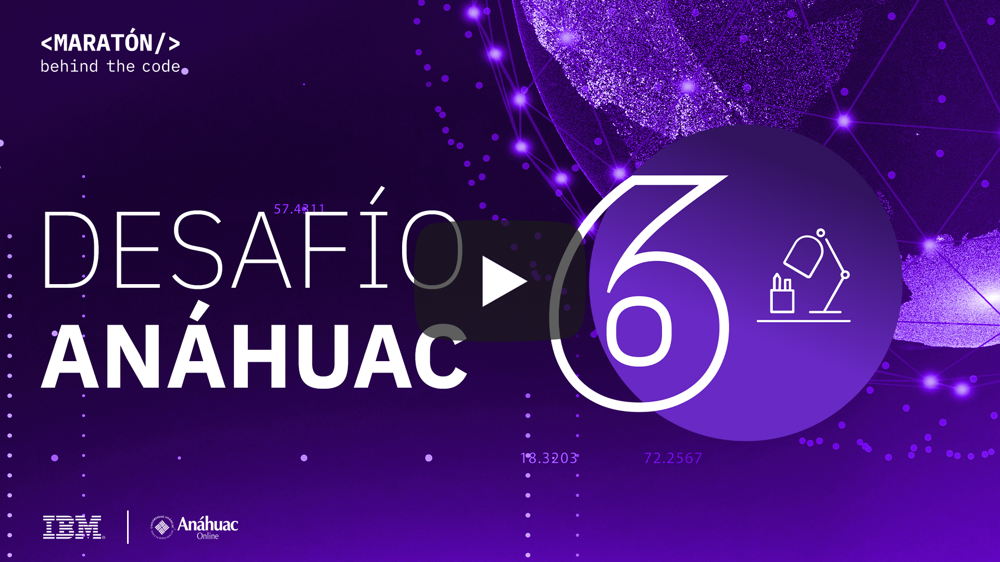
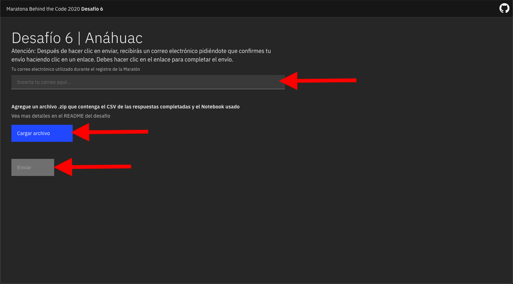

# Desafio 06 | Anáhuac

- [1. Acerca de Anáhuac](#1-acerca-de-anáhuac)
- [2. Reto de negocio](#2-reto-de-negocio)
- [3. Objetivo](#3-objetivo)
- [4. Desarrollando la solución](#4-desarrollando-la-solución)
  - [4.1. Pre-requisitos](#41-pre-requisitos)
  - [4.2. Resumen de las tareas](#42-resumen-de-las-tareas)
  - [4.3. Desarrollo](#43-desarrollo)
- [5. Envío](#5-envío)
- [6. Sobre la evaluación](#6-sobre-la-evaluación)

## Para Ayudarte

- [Material de apoyo](#material-de-apoyo)
- [Solución de problemas](#solución-de-problemas)
- [Licencia](#licencia)

## 1. Acerca de Anáhuac

La universidad Anáhuac esta comprometida con la excelencia educativa y busca realizar la mayor contribución posible al mundo educativo. En este esfuerzo, la Red de Universidades cuenta 56 licenciaturas, 50 maestrías, 33 especialidades y 17 doctorados ofrecidos en la modalidad presencial. En la modalidad en línea cuenta con 117 programas de educación continua, 18 maestrías y 7 especialidades, contando en total con cerca de 6000 alumnos. Actualmente en el sector educativo de México se han identificado los siguientes tres retos:

1.  Garantizar el acceso a la educación para permitirles a todas las personas de diferentes estratos sociales el derecho a una educación digna.
2.  Mantener una alta calidad educativa. Dentro de este punto, la universidad Anáhuac busca que no solamente se desarrolle educación con alta calidad profesional, sino que también se formen estudiantes con alta calidad ética y social.
3.  Maximizar el éxito académico de los estudiantes, es decir que dentro de los estudiantes que accedan a los diferentes niveles educativos, la taza de estudiantes que completen sus programas sea alta.

    

## 2. Reto de negocio

La Universidad Anáhuac busca incrementar el éxito académico de los estudiantes a través de diferentes estrategias académicas y de la generación de diferentes planes de apoyo tanto social como emocional a sus estudiantes. Sin embargo; creen que todavía pueden realizar más para asegurar el éxito académico de sus estudiantes.

En lo que respecta a la educación en línea, uno de los principales problemas consiste en prevenir la deserción. Para lograrlo es importante conocer a los estudiantes y su comportamiento; no obstante, el problema se vuelve aún más complejo cuando se quiere dar un seguimiento personalizado a más de 6,000 estudiantes en línea con recursos económicos y de tiempo limitado. Hoy es fundamental ayudar a aquellos estudiantes que tengan mayores probabilidades de deserción estudiantil a través de diversas estrategias que pueden partir de actividades sencillas como agendar una llamada telefónica o implementar un sistema más personalizado de asesorías.

Anáhuac cuenta con mucha información relacionada con el desempeño y actividad de los estudiantes, el reto está en poder identificar las variables que mayor impacto tienen en la deserción y construir un buen modelo para tomar acción rápida y eficiente.

## 3. Objetivo

Anáhuac tiene una enorme cantidad de información de comportamiento de los estudiantes de los diferentes programas en linea. El participante debe desarrollar un algoritmo o un modelo de Machine Learning que sea capaz de predecir cuáles alumnos aprobarán con éxito el programa de posgrado al que se inscriben y cuales desertarán

En este desafío, Anáhuac usará herramientas de IBM como *[Watson Studio (o Cloud Pack for Data)](https://cloud.ibm.com/catalog/services/watson-studio)*  para construir un modelo de Machine Learning.

La idea esencial del Desafío 6 es crear un modelo basado en machine learning capaz de identificar la probabilidad de éxito o deserción estudiantil permitiendo tomar acciones a tiempo por la Universidad.

## 4. Desarrollando la solución

En este desafío vamos a usar las siguiente herramienta

*[Watson Studio](https://cloud.ibm.com/catalog/services/watson-studio)* proporciona un conjunto de herramientas y un entorno colaborativo para científicos de datos, desarrolladores y expertos en dominios. Es un ambiente de desarrollo (IDE) web que combina herramientas Open Source con tecnología de IBM para desarrollar modelos de Machine Learning y Deep Learning.

Mira el tutorial a continuación para aprender como aplicar la tecnología de IBM para resolver el desafío

    

### 4.1. Pre-requisitos

Para poder realizar este desafío, se deben cumplir con los siguientes requisitos previos:

- Estar registradro en la [Maratón Behind the Code](https://maratona.dev/es) y confirmar el e-mail de registro.
- Tener una cuenta en [IBM Cloud](https://ibm.biz/registro-maratona), que puede ser una cuenta GRATUITA o de pago (no es necesario registrarse en el evento con el mismo correo electrónico utilizado para crear su cuenta IBM Cloud).

### 4.2. Resumen de las tareas

1. Cree el servicio [Watson Studio (Cloud Pak for Data as a Service)](https://cloud.ibm.com/catalog/services/watson-studio)  en IBM Cloud. (Si ya lo creo en el desafío 2 no es necesario volverlo a crear)
2. Cree el servicio [Cloud Object Storage](https://cloud.ibm.com/catalog/services/cloud-object-storage) (Si ya lo creo en el desafío 2 no es necesario volverlo a crear)
3. [Crear un nuevo proyecto vacío en Watson Studio](https://dataplatform.cloud.ibm.com/projects/new-project?context=cpdaas).
4. Crear el token de acceso al proyecto
5. Importar el notebook usando el archivo `anahuac.ipynb`
6. Leer y ejecutar las instrucciones contenidas en el Notebook `anahuac.ipynb`.
7. Guarde el csv como `results.csv` con sus predicciones y el notebook que desarrolló `anahuac.ipynb`.
8. Envíe su solicitud a [https://anahuac.maratona.dev/](https://anahuac.maratona.dev/)

### 4.3. Desarrollo

La idea esencial del Desafío 6 es crear un modelo basado en machine learning capaz de predecir el exito o deserción estudiantil. El participante trabajará con un conjunto de datos sintéticos proporcionados y creará una modelo que realice la predicción y producir un archivo csv con los resultados.

  <h3>Bases de datos compartidas con los participantes:</h3>
  <table class="tg">
  <thead>
    <tr>
      <th class="tg-c3ow">ArchivoEnrollments</th>
      <th class="tg-c3ow">Descripción</th>
    </tr>
  </thead>
  <tbody>
    <tr>
      <td class="tg-c3ow">OrdenMaterias.csv</td>
      <td class="tg-c3ow">29  Columnas:  reducido,  y  28  columnas  que  corresponden  a  los diferentes instantes en que se pueden iniciar las materias (junto al orden en que se cursarían)</td>
    </tr>
    <tr>
      <td class="tg-c3ow">TablaConexiones.csv</td>
      <td class="tg-c3ow">5 Columnas: studentId, ciclo, Dias_Conectado, Minutos_Promedio, Minutos_Total</td>
    </tr>
    <tr>
      <td class="tg-c3ow">TablaTareas.csv</td>
      <td class="tg-c3ow"> 7 Columnas: studentId, ciclo, Calificacion_Promedio, Tareas_Puntuales, Tareas_No_Entregadas,    Tareas_Retrasadas, Total_Tareas </td>
    </tr>
    <tr>
      <td class="tg-c3ow">ForTraining.csv</td>
      <td class="tg-c3ow"> El archivo contiene la información de los alumnos. 3  variables  para  realizar  la  unión  con  las  otras variables  con  las que se predecirá: studentId, reducido y ciclo. 1 variable objetivo: Graduado. </td>
    </tr>
    <tr>
      <td class="tg-c3ow">ToBePredicted.csv </td>
      <td class="tg-c3ow"> El archivo contiene la información de los estudiantes a evaluar. 3 variables para realizar la predicción: studentId, reducido y ciclo. </td>
    </tr>    
  </tbody>
  </table>

- reducido: Es el nombre del curso o carrera cursada 
- ciclo: Periodo en que se curso la materia  o curso.
- studentId: Id unico del estudiante

En este repositorio encuentra el notebook necesario para crear proyecto completo en Watson Studio ya con una solución básica lista, totalmente funcional. Puede (y se recomienda) mejorar el modelo para obtener una mayor puntuación.

## 5. Envío

Para hacer la entrega, debes acceder a la siguiente página: [https://anahuac.maratona.dev/](https://anahuac.maratona.dev/) y cargar un archivo zip  con el archivo csv `results.csv` con los resultados de su predicción y el notebook que desarrolló `anahuac.ipynb`.

**Si cambia el nombre o formato del archivo csv su solución no será evaluada**

**Si cambia el nombre del notebook su solución no será evaluada**

Después de cargar su archivo haga clic en el botón en la esquina inferior derecha para ENVIAR su solución, como se muestra en la imagen a continuación, y complete el formulario con su dirección de correo electrónico utilizada de la inscripción en MARATÓN 2020.

Enviar:
</img>

## 6. Sobre la evaluación

En esencia, el reto puntuará la respuesta de su modelo en un archivo csv. En esta ocación se hara una prueba basada en el _F1 Score_, que mide tanto la presición como el recall. No se desea clasificar como deserción aquellos estudiantes que en verdad serian exitos, quitandole recursos a estudiantes que lo necesitarian más, por lo que el dataset de pruebas estará balanceado. Como se explica en el vídeo tutorial, el problema que debe resolver el modelo de machine learning es un problema clásico de clasificación binaria, y se encuentran más detalles en el notebook jupyter proporcionado.

La rapidez de entrega no se incluye en el cálculo de la puntuación del desafío. Sin embargo, para todos los participantes que presenten este desafío en la primera semana después del lanzamiento, recibirán una bonificación del 10% en la puntuación final de la entrega.

Recuerde que tiene 3 oportunidades de envío de la solución del reto donde se le tomará en cuenta el envío que obtenga mejor puntuación.

## Material de apoyo

- [Video Watson Studio](https://www.youtube.com/watch?v=BecC1U5PJT4)
- [Una guía del portal de IBM Developer para principiantes del Machine Learning](https://developer.ibm.com/es/patterns/use-icp4d-to-build-the-machine-learning-model-for-return-propensity/)
- [Watson Studio Docs](https://dataplatform.cloud.ibm.com/docs/content/?context=cpdaas)

## Solución de problemas

Mira el [video explicativo](#4-desarrollando-la-solución) provisto en la Sección 4, o si lo deseas, revisa la documentación de los servicios involucrados en este desafío.

> Si ya consumio todo su plan gratuito de Watson Studio puede crear otra cuenta de [IBM Cloud](https://ibm.biz/registro-maratona) con otro correo.

Accede al discord oficial de la Maratón 2020 para hacer preguntas y/o interactuar con otros participantes: [Discord](https://discord.gg/Q9At74C).

## Licencia

Copyright 2020 Maratona Behind the Code

Licensed under the Apache License, Version 2.0 (the "License");
you may not use this file except in compliance with the License.
You may obtain a copy of the License at

       http://www.apache.org/licenses/LICENSE-2.0

Unless required by applicable law or agreed to in writing, software
distributed under the License is distributed on an "AS IS" BASIS,
WITHOUT WARRANTIES OR CONDITIONS OF ANY KIND, either express or implied.
See the License for the specific language governing permissions and
limitations under the License.
